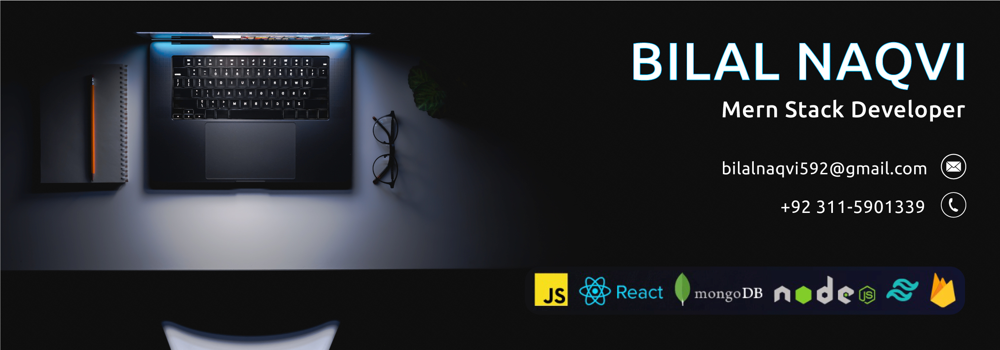

🚀 **Passionate Fullstack Web Developer**  
Creating robust and scalable applications, skilled in both front-end and back-end technologies with a strong focus on performance and user experience.

## ⚡ Rapid Fire
- 💬 Ask me about:  **JavaScript, React, Node.js, MongoDB, and RESTful APIs**
- 💼 Currently working on:   **Working on SharePoint Web Parts**
- 📚 Learning:  **React Native** & **Google Cloud**
- ⚡ Fun fact: _I once debugged an issue while on a roller coaster!_
- 📂 My Products: [myroducts.com](https://businexcloud.com/)

---

## 🛠 Skills

---

  
  

### Connect with me:

## ☕ Support Me

